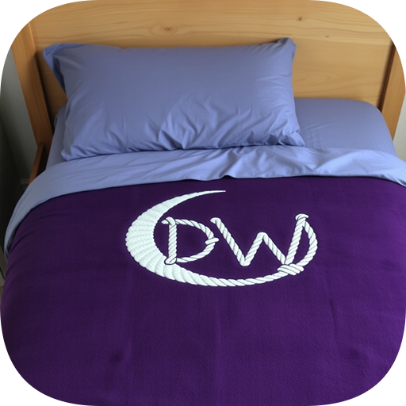

# 🌙 DreamWeaver Frontend 😴



> *Mindful sleep, made digital.*

---

![Screenshot of DreamWeaver App](./public/screenshot.pn---
## 🏆 Development Methodology

Visual assets included in this project were generated using AI technology provided by ImagePrompt.org.

Favicons were produced by converting images with the assistance of RedKetchup's Favicon Generator.

**AI-Assisted Development**: This project demonstrates effective collaboration with AI tools for enhanced development efficiency. GitHub Copilot was leveraged for comprehensive code review, debugging assistance, documentation generation, and quality assurance. This approach showcases modern development practices where AI augments developer capabilities for improved code quality, faster problem resolution, and maintainable software architecture.

This project is a student portfolio piece intended for educational and demonstrative purposes.

--- ✨ About the Project

DreamWeaver is a mindfulness and self-accountability app that helps users improve their sleep through intentional bedtime rituals and reflective journaling. With just a single tap, users can log their journey to sleep, capture dreams or sleepy thoughts, and track patterns over time.

This is the **frontend** repository, built using **React**, **Vite**, and **Bootstrap**.

---

## 🚀 Features

- 🔐 **Authentication System** - JWT-based signup, login, and secure logout
- 📱 **Mobile-First Design** - Responsive Bootstrap UI that works on all devices
- 🌒 **Interactive Dashboard** featuring:
  - User profile summary with customizable preferences
  - Bedroom environment management and tracking
  - Recent sleep sessions and dream journal entries
  - Quick access to all major app functions
- 🌛 **Sleep Tracking** - One-click "Go To Bed" and "Wake Up" with session logging
- 🎯 **BigActionButton** - Prominent Shazam-style circular button with:
  - Context-aware functionality (Go to Bed vs Wake Up based on current sleep state)
  - DreamWeaver logo integration with pulse animations
  - Consistent placement across landing page, about page, and error pages
  - Theme-aware styling and responsive design
- 📓 **Dream Journaling** - Capture thoughts, dreams, and reflections organized by sleep session
- 🛏️ **Smart Bedroom Management** - Track environmental factors (light, noise, temperature) across multiple sleeping spaces
- 📊 **Sleep Analytics** - View sleep history, patterns, and quality assessments over time
- ⚙️ **User Preferences** - Comprehensive preference system with site-wide consistency:
  - **Theme**: Dark/light mode with instant switching and persistence
  - **Units**: Imperial (°F, miles) vs Metric (°C, kilometers) for all measurements
  - **Date Format**: MM/DD/YYYY, DD/MM/YYYY, or YYYY-MM-DD across all components
  - **Time Format**: 12-hour (AM/PM) or 24-hour display for all time fields
  - **Sleep Reminders**: Configurable browser-based reminder system
  - Real-time preference sync across all app components and views
- 🧭 **Intuitive Navigation** - Semantic routing with breadcrumbs, back navigation, and user-friendly URLs
- 📱 **Enhanced Mobile UX** - Right-aligned slide-out navigation panel (50-60% screen width) with improved accessibility
- 🎨 **BigActionButton Component** - Reusable prominent action button with automatic sleep state detection and consistent theming
- 🛡️ **Admin Dashboard** - Comprehensive administrative interface featuring:
  - Role-based user management (admins listed first, then users alphabetically)
  - Individual user profile editing and management
  - Secure user deletion with admin password confirmation and cascade data removal
  - Mobile-friendly dual-mode user profile editing (self-edit vs admin-edit)
  - Permission-based restrictions (cannot edit other admins, delete admin accounts, or delete self)
  - Protected admin routes with proper authentication and authorization
- ♿ **Accessibility Features** - Screen reader support, ARIA labels, and keyboard navigation

---

## 🖼️ Screenshots

> Replace with your actual hosted image or drop a screenshot here.

---

## 🛠️ Tech Stack

- ⚛️ **React 18** with Vite for fast development and building
- 🎨 **Bootstrap 5** + Custom Sass for responsive styling
- 🧠 **React Context API** for state management (User, Dashboard, Theme contexts)
- 🔄 **Axios** for **all** HTTP requests and API integration with:
  - **100% standardized** - all services now use centralized API configuration
  - Automatic Bearer token injection via request interceptors
  - Consistent error handling and response patterns across all service modules
  - Complete elimination of fetch() usage and manual token handling
  - Unified service method signatures (no token parameters required)
- 🗺️ **React Router v6** for client-side routing and navigation
- 📅 **date-fns** for robust date formatting and manipulation
- 🎯 **Lucide React** for consistent iconography
- 🍞 **React Toastify** for user notifications
- 🌍 **Theme System** with user preference synchronization
- 🧪 **Modern Development Tools** - ESLint, Vite HMR, and modular architecture

---

## 📂 Project Structure

```
src/
├── components/           # Reusable UI components
│   ├── dashboard/       # Dashboard-specific components
│   ├── forms/           # Form components (Login, Signup, UserProfile, etc.)
│   ├── layout/          # Layout components (NavBar, Footer)
│   ├── admin/           # Admin-only components (AdminDashboard, AdminUserProfile, AdminOnlyRoute)
│   └── shared/          # Shared utility components (Loading, ThemeToggle, BigActionButton, etc.)
├── contexts/            # React Context providers (User, Dashboard, Theme)
├── hooks/               # Custom React hooks
├── services/            # **Fully standardized** API service modules with centralized axios configuration
│   ├── apiConfig.js     # Centralized axios instance with automatic token injection
│   ├── authService.js   # Authentication and token management
│   ├── userService.js   # User profile and preferences (converted to axios)
│   ├── adminService.js  # Admin user management (converted to axios)
│   ├── sleepSessionService.js  # Sleep session tracking (converted to axios)
│   ├── sleepDataService.js     # Sleep history and analytics (converted to axios)
│   └── bedroomService.js       # Bedroom environment management (converted to axios)
├── styles/              # Sass stylesheets and component-specific styles
├── assets/              # Static assets (images, logos, wireframes)
├── App.jsx              # Main application component with routing
└── main.jsx             # Application entry point
```

---

## 🚀 Getting Started

1. **Clone the frontend repo:**

   ```bash
   git clone https://github.com/macfarley/dream-weaver-frontend.git
   cd dream-weaver-frontend
   ```

2. **Install dependencies:**

   ```bash
   npm install
   ```

3. **Add your `.env` file:**

   ```
   VITE_BACK_END_SERVER_URL=http://localhost:3000
   ```

4. **Run the app locally:**

   ```bash
   npm run dev
   ```

---

## 👩‍💻 Developer Notes

- **Authentication**: All protected routes require JWT token validation through the backend API
- **Admin System**: Role-based access control with protected admin routes, user management interface, and secure deletion with cascade data removal
- **BigActionButton**: Prominent sleep action component with automatic state detection, consistent across multiple pages (landing, about, unauthorized)
- **Mobile Navigation**: Enhanced UX with right-aligned slide-out panel, click-outside-to-close, and improved accessibility
- **API Architecture**: **Fully standardized axios configuration** with:
  - Centralized API instance with automatic Bearer token injection via interceptors
  - Consistent error handling patterns across all service modules
  - Complete removal of fetch() and manual token handling
  - Standardized service method signatures (no token parameters needed)
  - Unified response handling and error propagation
- **State Management**: User preferences (units, theme, time format) sync between frontend contexts and backend storage
- **Error Handling**: Comprehensive error boundaries and user-friendly error messages throughout the application  
- **Accessibility**: Built with ARIA labels, screen reader support, and keyboard navigation standards
- **API Integration**: RESTful API communication with robust error handling and input validation, including dedicated admin endpoints
- **Code Quality**: Extensive JSDoc documentation, consistent code patterns, and comprehensive commenting
- **Security**: Input sanitization, token-based authentication, role-based access controls, and admin password confirmation for destructive operations
- **Performance**: Optimized builds, lazy loading, and efficient state management
- **Responsive Design**: Mobile-first approach with Bootstrap grid system and custom breakpoints

---

## 🌐 Deployment Notes

To deploy the frontend (e.g., Netlify, Vercel):

- Update `VITE_BACK_END_SERVER_URL` to match your production API endpoint.
- Ensure HTTPS and CORS headers are handled on the backend.
- Optionally build using:

  ```bash
  npm run build
  ```

---

## 🔗 Links

- 🧠 [Backend GitHub Repository](#)
- 💻 [Frontend GitHub Repository](#)
- 📖 [Live Site – Coming Soon](#)

---

## 📄 License

This project is licensed under the MIT License. See the LICENSE file for details.

---

## 🤝 Acknowledgments

Created as a final project for the General Assembly Software Engineering Bootcamp. Thanks to our instructors, peers, and the open-source community for inspiration and guidance.

---

## 🧙‍♂️ Author

Built by Macfarley (Mac McCoy)  
[LinkedIn](https://www.linkedin.com/in/travis-mccoy-630775b9/)

---
Acknowledgments
Visual assets included in this project were generated using AI technology provided by ImagePrompt.org.

Favicons were produced by converting images with the assistance of RedKetchup's Favicon Generator.

I would like to express my appreciation to OpenAI’s ChatGPT for serving as an invaluable resource for problem-solving, debugging, and providing guidance throughout the development process.

This project is a student portfolio piece intended for educational and demonstrative purposes.

---

## ❓ Support

 Run into issues? Head to [GitHub repo](https://github.com/macfarley/dream-weaver) and open an issue.
For feature requests, please create a new issue and label it as a feature request.
For bugs, please create a new issue and label it as a bug.
For general inquiries, please reach out via [LinkedIn](https://www.linkedin.com/in/travis-mccoy-630775b9/).